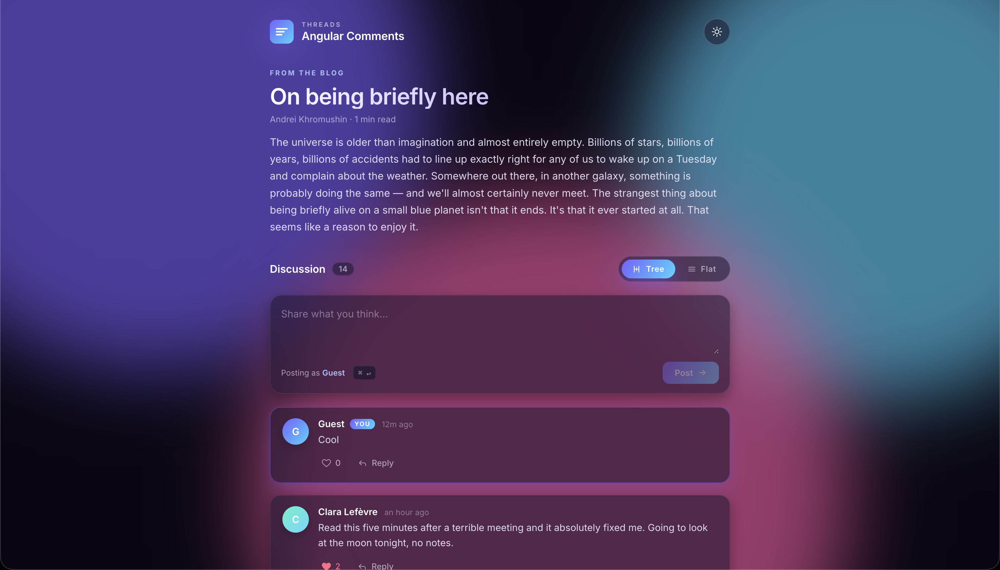
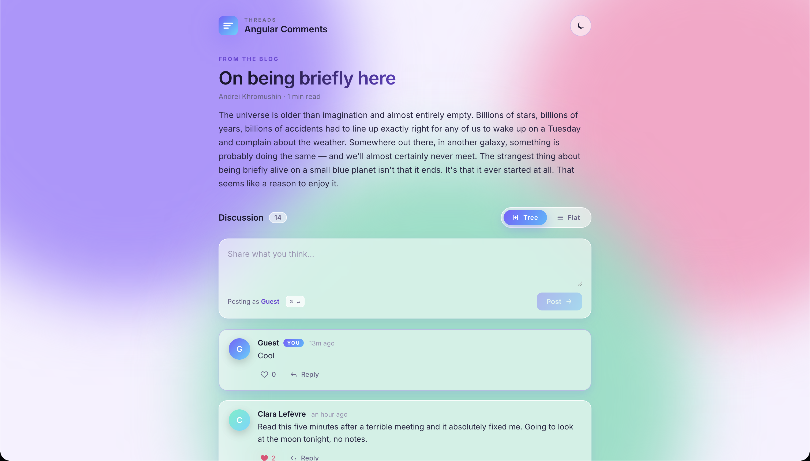

# Angular Comments

Here is a comments thread with tree and flat views, light and dark themes, and local persistence. You can look and try this
on [GitHub Pages](https://andreikhromushin.github.io/AngularComments/).

## Features

- Tree and flat view modes with a smooth toggle
- Inline reply composer with autofocus, `Esc` to cancel, `⌘↵` / `Ctrl+↵` to submit
- Like / unlike with deterministic per-user avatar gradients
- Auto-refreshing "time ago" labels
- Light and dark themes
- Comments, likes and theme persist to `localStorage`
- Built with Angular 21 (zoneless, signals, standalone) and pure CSS, no UI library

  

  

